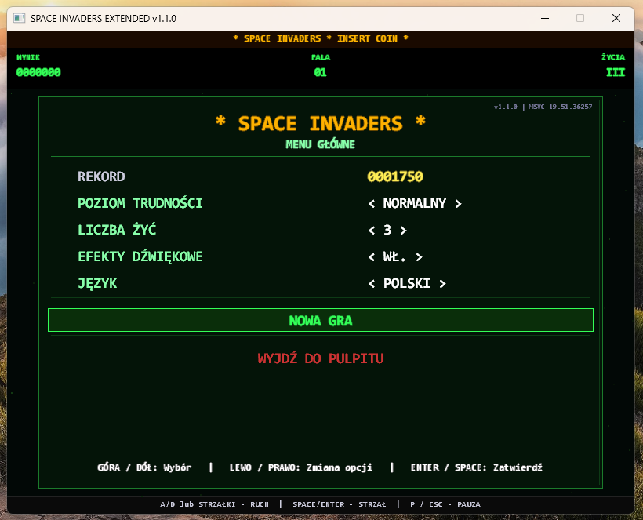

# Space Invaders Extended

[Polski](#polski) | [English](#english)



---

## Polski

Rozbudowana wersja klasycznej gry **Space Invaders** dla Windows, napisana w jednym pliku C++ z użyciem wyłącznie Win32 API i GDI. Bez zewnętrznych bibliotek i bez plików zasobów: wszystkie dźwięki są generowane programowo przy starcie.

---

## Funkcje

- Klasyczna rozgrywka: 5 rzędów wrogów (3 rodzaje) z animacją 2-klatkową
- 4 poziomy trudności (Łatwy / Normalny / Trudny / Szalony), życia: 1 / 2 / 3 / 5
- Kolejne fale szybsze i bardziej agresywne, premia +500 za ukończenie fali
- Niszczalne bunkry (inwazjerzy rozbijają je przy zetknięciu)
- Bonusowe UFO z ulepszeniami: **S** potrójny strzał (6 s), **L** +1 życie (maks. 5)
- Cząsteczki, drgania ekranu, błysk przy trafieniu
- Proceduralnie generowane dźwięki (bez plików `.wav`)
- Rekord oraz zapis i kontynuacja gry (`%LOCALAPPDATA%`)
- Menu główne, menu pauzy, automatyczna pauza po utracie fokusu
- Interfejs PL / EN (wykrywany automatycznie, przełącznik w menu)
- Stały krok 60 Hz niezależny od taktowania systemu
- Licencja Apache 2.0

---

## Sterowanie

| Klawisz | Akcja |
|---|---|
| `A` / `D`, `←` / `→` | Ruch (w menu: zmiana opcji) |
| `W` / `S`, `↑` / `↓` | Nawigacja po menu |
| `SPACE` / `ENTER` | Strzał (w menu: zatwierdzenie) |
| `P` / `ESC` | Pauza / wznowienie |

---

## Struktura repozytorium

```
SpaceInvadersExtended/
├── README.md
├── LICENSE
├── NOTICE
├── CHANGELOG.md
├── space.cpp
├── build.bat
├── .gitignore
├── .gitattributes
├── docs/
│   └── screenshot.png
└── .github/
    └── workflows/
        └── build.yml
```

---

## Instalacja i budowanie

**Wymagania:**
- Windows 10 / 11 (x64)
- Kompilator C++17: **MSVC** (Visual Studio 2022 / 2026 lub Build Tools z komponentem *Desktop development with C++*) albo **MinGW-w64 GCC 13+** (np. MSYS2 UCRT64)
- Źródło jest w UTF-8 (MSVC wymaga `/utf-8`, ustawione już w `build.bat`)

**Budowanie skryptem** (wykrywa kompilator, wypisuje jego wersję, buduje `Space.exe`):

```bat
build.bat            :: release, kompilator wykryty automatycznie
build.bat debug      :: bez optymalizacji, z symbolami
build.bat msvc       :: wymuś MSVC
build.bat mingw      :: wymuś MinGW-w64
build.bat clean      :: usuń pliki wynikowe
```

**Ręcznie:**

```bat
:: MSVC (x64 Native Tools Command Prompt)
cl /nologo /EHsc /O2 /MT /W3 /std:c++17 /utf-8 space.cpp /link /SUBSYSTEM:WINDOWS user32.lib gdi32.lib msimg32.lib winmm.lib /OUT:Space.exe

:: MinGW-w64
g++ -std=c++17 -O2 -static -mwindows space.cpp -o Space.exe -lgdi32 -luser32 -lmsimg32 -lwinmm
```

---

## Dane zapisu

| Plik | Zawartość |
|---|---|
| `%LOCALAPPDATA%\SpaceInvadersExtended\highscore.dat` | Rekord |
| `%LOCALAPPDATA%\SpaceInvadersExtended\savegame.dat` | Zapis gry (wynik, fala, życia, trudność) |

Aby wyzerować wszystko, usuń ten katalog. Gdy nie da się go utworzyć, pliki trafiają do katalogu roboczego.

---

## Uwagi

- **Tylko Windows** (Win32 / GDI).
- **Dźwięk:** efekty używają `PlaySound`, więc nowy efekt przerywa poprzedni.
- **DPI:** okno nie jest świadome DPI, na ekranach high-DPI skaluje je Windows.
- **Zapis gry** ma nagłówek i walidację, uszkodzony lub obcy plik jest ignorowany.
- **Kompilacja MSVC** jest docelowa; kod sprawdzono na MinGW-w64 GCC 13.

---

## Wsparcie projektu

Jeśli gra Ci się podoba i chcesz wesprzeć jej dalszy rozwój, możesz postawić mi wirtualną kawę:

<a href="https://suppi.pl/00maciek00" target="_blank"></a>

Dziękuję! ☕

---

## Licencja

Copyright 2026 Maciej Sikorski — S.M. DIY Home
Licencja Apache 2.0. Szczegóły w pliku [LICENSE](LICENSE).

---

**Projekt:** S.M. DIY Home

**Wersja:** 1.1.0  
**Autor:** Maciej Sikorski  
**Data:** 2026-10-01  
**Licencja:** Apache 2.0

---
---

## English

An extended version of the classic **Space Invaders** for Windows, written in a single C++ file using only the Win32 API and GDI. No external libraries and no asset files: all sounds are generated procedurally at startup.

---

## Features

- Classic gameplay: 5 rows of enemies (3 types) with 2-frame animation
- 4 difficulty levels (Easy / Normal / Hard / Insane), lives: 1 / 2 / 3 / 5
- Waves get faster and more aggressive, +500 bonus for clearing a wave
- Destructible bunkers (invaders crush them on contact)
- Bonus UFO with power-ups: **S** triple shot (6 s), **L** +1 life (max 5)
- Particles, screen shake, hit flash
- Procedurally generated sounds (no `.wav` files)
- High score and save/continue (`%LOCALAPPDATA%`)
- Main menu, pause menu, auto-pause when the window loses focus
- PL / EN interface (auto-detected, switch in the menu)
- Fixed 60 Hz step independent of the system timer resolution
- Apache 2.0 license

---

## Controls

| Key | Action |
|---|---|
| `A` / `D`, `←` / `→` | Move (in menus: change an option) |
| `W` / `S`, `↑` / `↓` | Menu navigation |
| `SPACE` / `ENTER` | Fire (in menus: confirm) |
| `P` / `ESC` | Pause / resume |

---

## Repository Structure

```
SpaceInvadersExtended/
├── README.md
├── LICENSE
├── NOTICE
├── CHANGELOG.md
├── space.cpp
├── build.bat
├── .gitignore
├── .gitattributes
├── docs/
│   └── screenshot.png
└── .github/
    └── workflows/
        └── build.yml
```

---

## Installation and Building

**Requirements:**
- Windows 10 / 11 (x64)
- C++17 compiler: **MSVC** (Visual Studio 2022 / 2026 or Build Tools with the *Desktop development with C++* workload) or **MinGW-w64 GCC 13+** (e.g. MSYS2 UCRT64)
- The source is UTF-8 (MSVC needs `/utf-8`, already set in `build.bat`)

**Build with the script** (detects the compiler, prints its version, builds `Space.exe`):

```bat
build.bat            :: release, compiler auto-detected
build.bat debug      :: no optimization, with symbols
build.bat msvc       :: force MSVC
build.bat mingw      :: force MinGW-w64
build.bat clean      :: remove build output
```

**Manually:**

```bat
:: MSVC (x64 Native Tools Command Prompt)
cl /nologo /EHsc /O2 /MT /W3 /std:c++17 /utf-8 space.cpp /link /SUBSYSTEM:WINDOWS user32.lib gdi32.lib msimg32.lib winmm.lib /OUT:Space.exe

:: MinGW-w64
g++ -std=c++17 -O2 -static -mwindows space.cpp -o Space.exe -lgdi32 -luser32 -lmsimg32 -lwinmm
```

---

## Save Data

| File | Content |
|---|---|
| `%LOCALAPPDATA%\SpaceInvadersExtended\highscore.dat` | High score |
| `%LOCALAPPDATA%\SpaceInvadersExtended\savegame.dat` | Saved game (score, wave, lives, difficulty) |

Delete this folder to reset everything. If it cannot be created, the files go to the working directory.

---

## Notes

- **Windows only** (Win32 / GDI).
- **Sound:** effects use `PlaySound`, so a new effect interrupts the previous one.
- **DPI:** the window is not DPI-aware, Windows scales it on high-DPI displays.
- **Save game** has a header and is validated, a corrupted or foreign file is ignored.
- **MSVC build** is the target; the code was verified with MinGW-w64 GCC 13.

---

## Support the project

If you enjoy the game and would like to support its further development, you can buy me a virtual coffee:

<a href="https://suppi.pl/00maciek00" target="_blank"></a>

Thank you! ☕

---

## License

Copyright 2026 Maciej Sikorski — S.M. DIY Home  
Licensed under Apache 2.0. See [LICENSE](LICENSE) for details.

---

**Project:** S.M. DIY Home

**Version:** 1.1.0  
**Author:** Maciej Sikorski  
**Date:** 2026-10-01  
**License:** Apache 2.0
